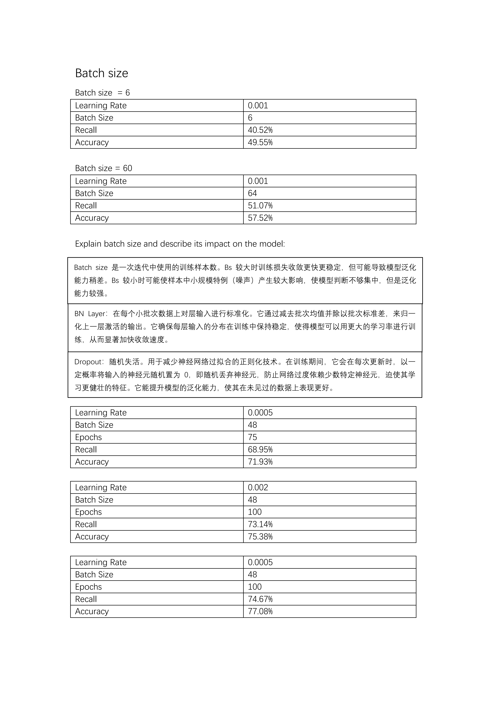
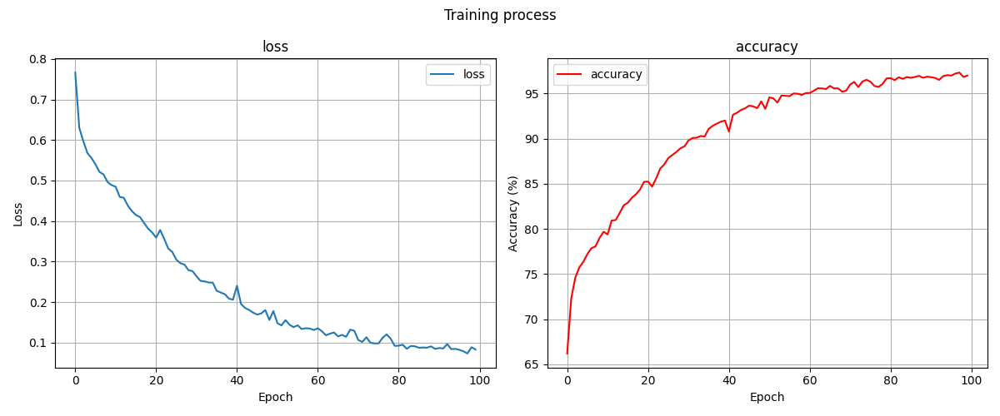
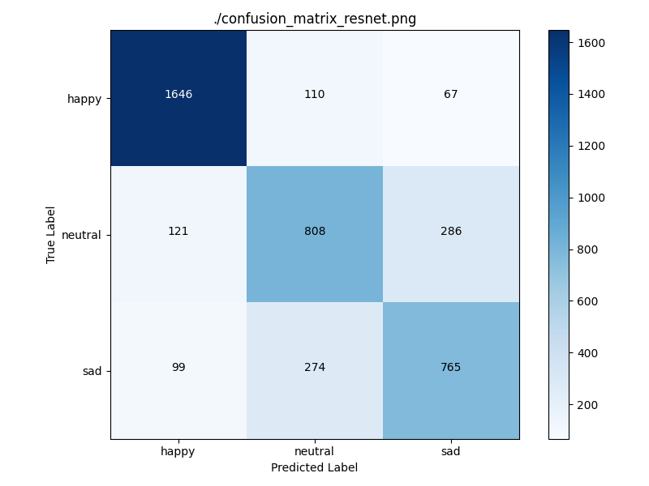
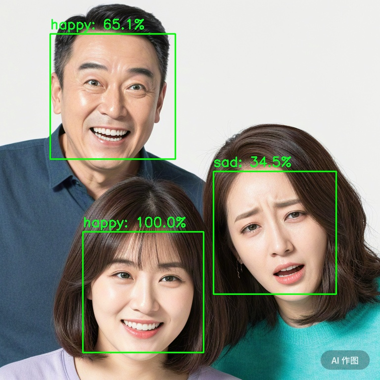
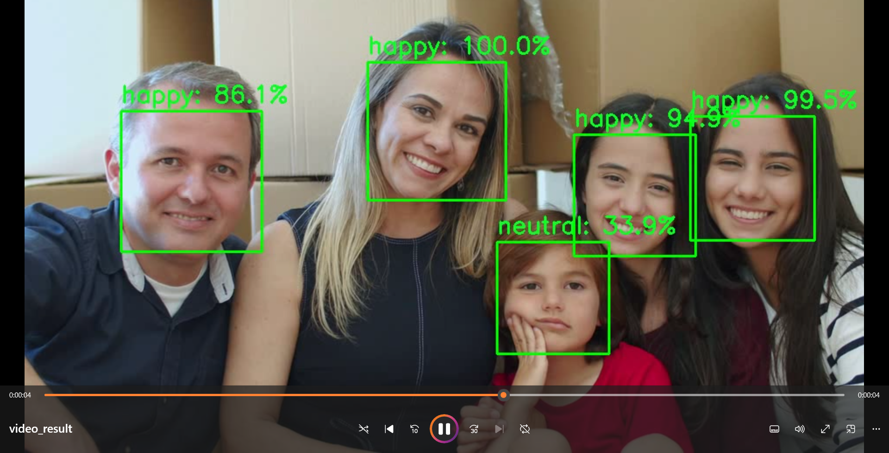
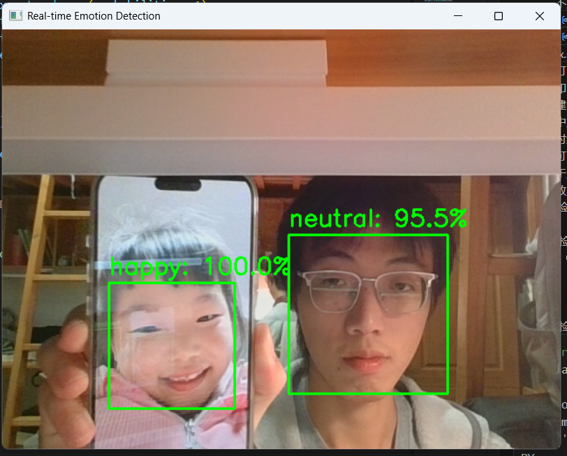
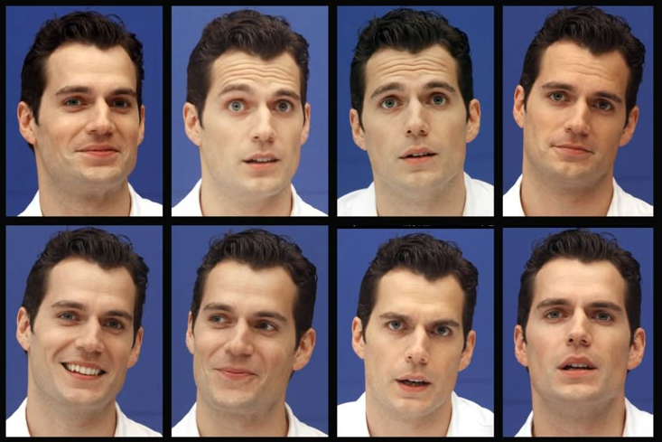
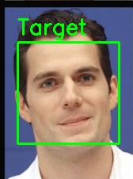

# **Project report: Face Detection and Emotion Classification**
Student name: 陈思翰， 张隽綦， 韩书航  
Student ID: 2025533033, 2025533058, 2025533100
## **1. BRIEF SUMMARY**
### **Objectives**
- This project aims to design and implement an end-to-end system for automatically detecting human faces in images and videos and classifying them into three emotions: "happy", "neutral", and "sad" (or more emotions counting on the trained models).

### **Main methods**
- There are two main process:
1. Face detection is carried out using `Haar Cascade classifier` of `OpenCV`; 
2. Then, the detected faces are sent to a `Convolutional neural network` built with `PyTorch` to evaluate whether the picture's feature match the feature of some certain emotions.

### **Final outcomes**
1. Our main product is the data form displayed below, which quantified the ability of our models to detect emotions. We adjusted the hyperparameters and trained various models, then we evaluated their accuracy and recall with the validator provided in LAB5.



2. We visualized our training process and outcome with matplotlib, so that we could see how the model optimized itself and fix errors.  
(this is the visualized model that was trained through 100 epochs)



3. Besides the quantified data, we successfully applied our detection model to identify our demo picutures and videos.



<div style="page-break-after: always;"></div>

## **2. Structure of Project Files**

- This is our general project structure:  
  
  ```
  PROJECT/  
  ├── LAB1/  
  │   └── lab1.py    # getting familiar with basic functions of OpenCV 
  ├── LAB2/  
  │   ├── haar-cascade-files/  
  │   │   ├── haarcascade_frontalface_default.xml    # key files to detect frontfaces in the picture  
  │   │   └──...(other .xml files)  
  │   ├── lab2_a.py    # practice the read and write functions in OpenCV  
  │   ├── lab2_b.py    # practice basic process of detection with haar-cascade-files 
  │   └── bonus.py    # apply NMS to reduce overlapping
  ├── LAB3/
  │   ├── lab3_empty.py    # process a picture with convolutional net to aquire feature maps  
  │   └── lab3_bonus/
  │       ├── conv_w.npy    # the kernel used to match each picture and generate its feature maps       
  │       ├── fc.npy    # the full connect method used to add weight and biases to the map     
  │       └── lab3_bonus_empty.py    # process a batch of pictures 
  ├── LAB4/
  │   ├── LAB4_empty/  
  │   │   ├── train_emotion_classifier.py    # set up environment and train the model
  │   │   ├── my_net/
  │   │   │   ├── __init__.py    # make the folder a package that can be imported  
  │   │   │   ├── classify.py    # define the model architecture
  │   │   │   └── utility.py    # set up data pipeline  
  │   │   └── images/    # train and validation data set
  │   └── export_onnx.py    # output the .pth model as .onnx files to be visualized
  ├── LAB5/
  │   └── valid.py    # evaluate the model's accuracy and recall on the validation set
  ├── LAB6/
  │   ├── integration.py    # integrate face detection and emotion identification  
  │   └── video_emotion.py    # an integrated detector to process videos
  └── LAB7/    # retrain the models with optimized data set and resnet
  ```

- **Detailed illustration:**
  There are two main function blocks: the detection block and the identification block.
1. Detection block: mainly in folder LAB2, and the crucial part is the `haar-cascade-files` folder.
  - `haarcascade_frontalface_default.xml` and other pretrained models contain feature parameters.
  - Python files call these models to process pictures and return results that meets the conditions in the form of ndarray.
2. Identification block: mainly in folder LAB4, and the crucial part is the `my_net` folder and `train_emotion_classifier.py`, where the convolutional neural network is constructed and applied to train models based on data set.
  - __init__.py: Turn the folder into a Python package.
  - classify.py: 
    - Define the core neural network architecture `emotionNet`  
    - Provide a factory function makeEmotionNet to quickly create a model instance, loss function, and the optimizer.
  - utility.py: include all the auxiliary functions related to data loading, preprocessing, visualization and training loops.
  - train_emotion_classifier.py: Define hyperparameters, call the functions in `utility` and `classify`, concatenate the entire training process, and save the final model.   
- **Supplementary instruction：**
  The validation and integration in LAB5 and LAB6 is not the key role in the construction of the project, however are indispensable because they evaluate the model and generate real production.
1. (LAB5)valid.py: 
  - Load the weights of a trained model (.pth file).
  - Load an independent verification/test dataset.
  - First, conduct rapid prediction and evaluation on a single batch and visualize the results.
  - Then conduct a comprehensive evaluation across the entire validation dataset.
  - Calculate and print the total accuracy rate, macro average recall rate, detailed metricsfor each category (precision rate, recall rate), and visualize the confusion matrix.
  - By evaluating different accuracy and recall that different parameters bring, we couldadjust the parameters to achieve a better identification capability.
2. (LAB6) integration.py:
  - Read the Haar cascade XML and load it via cv2.CascadeClassifier.
  - Instantiate CNN (emotionNet), call load_state_dict to load the weights into the model, switch to eval mode and move the model to the specified device.
  - Preprocessing: BGR→RGB; resize; totensor; normalization then generate batch tensors for model input.
  - Perform a one-time forward on the entire batch, use softmax to obtain the probability, and take the maximum probability and index as the prediction label and confidence level.

<div style="page-break-after: always;"></div>

## **3. Project Workflow**

### **Detection**

1. **Image Loading & Preprocessing**
   
  - Read the image files using `cv2.imread()`, which returns a `numpy.ndarray`.
  - The color image is converted to grayscale using `cv2.cvtColor()` with the `COLOR_BGR2GRAY` flag, as Haar Cascade detection operates on single-channel images.
  - USing `assert` to ensure the image was loaded successfully.
     
  ```python
  # Load pre-trained cascade file
  face_cascade = cv2.CascadeClassifier('haarcascade_frontalface_default.xml')
  # Read image and convert to grayscale
  image = cv2.imread('demo.png')
  assert image is not None
  # Convert to gray image
  gray = cv2.cvtColor(image, cv2.COLOR_BGR2GRAY)
  ```

2. **Object Detection**
   
  - A pre-trained Haar Cascade model is loaded from its `.xml` file using `cv2.CascadeClassifier()`.
  - The `.detectMultiScale()` method is called on the classifier, passing the grayscale image. This method scans the image at multiple scales to find objects matching the trained features.
  - The method returns a list of bounding boxes `(x, y, w, h)` for all detected faces.
     
  ```python
  faces = face_cascade.detectMultiScale(gray, scaleFactor=1.1, minNeighbors=5, minSize=(3030))
  ```

3. **Post-processing**
   
  - The `.detectMultiScale2()` method is used to get both the bounding boxes and their corresponding confidence scores.
  - These boxes and scores are passed to the **Non-Maximum Suppression (NMS)** algorithm using `cv2.dnn.NMSBoxes()`.
  - NMS filters the boxes, returning only the indices of the most confident, non-overlapping detections.
     
  ```python
  scores_list = numDetections.flatten().tolist()
  boxes_list = faces.tolist()
  nms_threshold = 0.3
  score_threshold = 0.0
  # Apply Non-Maximum Suppression
  indices = cv2.dnn.NMSBoxes(boxes_list, scores_list, score_threshold, nms_threshold)
  ```

4. **Visualization & Saving**
   
  - A loop iterates through the final list of filtered bounding boxes.
  - For each detected face, `cv2.rectangle()` is used to draw a bounding box on the original color image.
  - Optionally, `cv2.putText()` can be used to add labels. 
  - The final annotated image is displayed in a window using `cv2.imshow()` and `cv2.waitKey()`.
  - Optionally, the result is saved to a new image file using `cv2.imwrite()`.
     
  ```python
  # Draw rectangles around detected faces
  for (x, y, w, h) in faces:
    cv2.rectangle(image, (x, y), (x + w, y + h), (0, 255, 0), 2)
  
  # Display the result
  cv2.imshow('Detected Faces', image)
  cv2.waitKey(0)
  ```

### **Training**

1. **Data Pipeline Setup (`utility.py`)**
   
  - An image preprocessing pipeline is defined using `torchvision.transforms.Compose`. This pipeline includes converting images to `Tensor` format, resizing them to a uniform size, and normalizing the pixel values.   
  - The `torchvision.datasets.ImageFolder` utility is used to automatically load image paths and their corresponding class labels from a structured directory (`root/class_name/image.jpg`).
  - The `ImageFolder` instance is wrapped in a `torch.utils.data.DataLoader`. The `DataLoader` is responsible for batching the data, shuffling it randomly for training, and providing an iterable stream of data to the model.
     
  ```python
  transform = {
            "training":
        transforms.Compose(
        [
        transforms.RandomHorizontalFlip(),  # 随机水平翻转
        transforms.RandomRotation(10),  # 随机旋转 ±10度
        transforms.RandomCrop(44),  # 随机裁剪到44x44大小
        transforms.Resize((48, 48)),  # 调整回48x48大小
        transforms.ToTensor(),
        transforms.Normalize((0.5, 0.5, 0.5), (0.5, 0.5, 0.5))]),
            "evaluate":
        transforms.Compose(
        [
        transforms.ToTensor(),
        transforms.Normalize((0.5, 0.5, 0.5), (0.5, 0.5, 0.5))]),
    }
  
  def imshow_with_labels(images, labels, classes):
    num_images = len(images)
    grid_size = int(np.ceil(np.sqrt(num_images)))
    fig, axs = plt.subplots(grid_size, grid_size, figsize=(15,15))
    axs = axs.flatten()
  
    for i in range(grid_size**2):
        if i< num_images:
            img = images.data[i].numpy().transpose((1,2,0)) # CHW to HWC
            img = img/2 + .5 # undo normalization
            label = classes[labels[i]]
            axs[i].imshow(img, cmap='gray')
            axs[i].set_title(f'Label: {label}')
            axs[i].axis('off')
        else:
            axs[i].axis('off')
    plt.tight_layout()
    plt.show()
  
  def load_data(path, batch_size, DataType):
    Dataset = ImageFolder(path, transform=transform[DataType])
    if batch_size == 0:
        batch_size = len(Dataset)
    Dataloader = DataLoader(Dataset ,batch_size=batch_size,shuffle=True, drop_last=True)
    return Dataset, Dataloader
  
  def loadTrain(path, batch_size):
    train_path = os.path.join(path, "train")
    trainset, train_loader = load_data(train_path, batch_size, "training")
    dataiter = iter(train_loader)
    # get a batch of training data
    images, labels = next(dataiter) 
    # Show images
    imshow_with_labels(images, labels, trainset.classes)
    return train_loader, trainset.classes
  ```

2. **Model Architecture Definition (`classify.py`)**
   
  - A custom model class (`emotionNet`) is created, which inherits from the base `torch.nn.Module`. 
  - Within the `__init__` constructor, all network layers with learnable parameters (such as `nn.Conv2d`, `nn.BatchNorm2d`, `nn.Linear`) are declared as class attributes (e.g., `self.conv1`).
  - The `forward(self, x)` method defines the data flow, specifying the sequence in which the input data `x` passes through the declared layers to construct the forward propagation graph.
     
  ```python
  class emotionNet(nn.Module):
    def __init__(self, printtoggle):
        super().__init__()
        self.print = printtoggle
        # step1:
        # Define the functions you need: convolution, pooling, activation, and full connected functions.
        self.conv1 = nn.Conv2d(in_channels=3, out_channels=64, kernel_size=3, stride=1,padding=1)
        self.bn1 = nn.BatchNorm2d(64)
        self.pool1 = nn.MaxPool2d(kernel_size=2)
        self.relu1 = nn.LeakyReLU()
  
        self.conv2 = nn.Conv2d(in_channels=64, out_channels=128, kernel_size=3, stride=1,padding=0)
        self.bn2 = nn.BatchNorm2d(128)
        self.pool2 = nn.MaxPool2d(kernel_size=2)
        self.relu2 = nn.LeakyReLU()
  
        self.conv3 = nn.Conv2d(in_channels=128, out_channels=256, kernel_size=4, stride=1,padding=0)
        self.bn3 = nn.BatchNorm2d(256)
        self.pool3 = nn.MaxPool2d(kernel_size=2)
        self.relu3 = nn.LeakyReLU()
  
        self.fc1 = nn.Linear(in_features=4096, out_features=3) 
        self.relu4 = nn.LeakyReLU()
        self.dropout = nn.Dropout(p=0.4)

    def forward(self, x):
        #Step 2
        # Using the functions your defined for forward propagate
        # First block
        # convolution -> maxpool -> relu
        x = self.conv1(x)
        x = self.bn1(x)
        x = self.relu1(x)
        x = self.pool1(x)
        # Second block
        # convolution -> maxpool -> relu
        x = self.conv2(x)
        x = self.bn2(x)
        x = self.relu2(x)
        x = self.pool2(x)
        # Third block
        # convolution -> maxpool -> relu
        x = self.conv3(x)
        x = self.bn3(x)
        x = self.relu3(x)
        x = self.pool3(x)
        # Flatten for linear layers
        x = torch.flatten(x, start_dim=1)

        print(f"Shape after flatten: {x.shape}") 
        # fully connect layer
        x = self.fc1(x)
        x = self.relu4(x)
        x = self.dropout(x)

        return x
  ```

3. **Training Environment Setup (`train_emotion_classifier.py`)**
   
  - An instance of the model is created: `model = emotionNet()`.
  - A loss function is selected and instantiated, typically `lossfun = nn.CrossEntropyLoss()` for classification tasks.
  - An optimizer is chosen and instantiated, such as `optimizer = torch.optim.Adam(model.parameters(), ...)`, and the model's parameters are passed to it.
  - Hyperparameters like `epochs`, `batch_size`, and `learning_rate` are defined.
  - The computation device (CPU or GPU) is determined using `device = torch.device(...)`, and the model is moved to this device with `model.to(device)`.
     
  ```python
  batchsize = 48
  device = torch.device('cuda:0' if torch.cuda.is_available() else 'cpu')
  print("Training Device: ", device)
  # Load dataset
  train_loader, classes= my_net.utility.loadTrain("./images", batchsize)
  # Set model, lossfunc and optimizer
  model,lossfun,optimizer = my_net.classify.makeEmotionNet(False)
  # Start training process
  epochs = 100
  losses, accuracy, _ = my_net.utility.function2trainModel(model, device, train_loader,lossfun, optimizer, epochs)
  ```

4. **Model Training (in `function2trainModel`)**
   
  - The model is switched to training mode by calling `model.train()`.
  - The script iterates through the `DataLoader`. For each batch:  
       a. Data and labels are moved to the selected `device`.  
       b. `optimizer.zero_grad()` is called to clear gradients from the previous iteration.  
       c. A forward pass is performed to get predictions: `yHat = model(X)`.  
       d. The loss is computed by comparing predictions and true labels: `loss = lossfun(yHat, y)`.  
       e. `loss.backward()` is called to perform backpropagation and compute gradients for all parameters.  
       f. `optimizer.step()` is called to update all model parameters based on the computed gradients.  
  - The average loss and accuracy for the epoch are recorded.
     
  ```python
  def function2trainModel(model, device, train_loader, lossFun, optimizer, epochs):
    model.to(device)
    # initialize losses
    trainLoss = np.zeros(epochs)
    trainAcc  = np.zeros(epochs)
  
    for epochi in range(epochs):
        # loop over training data batches
        model.train() # switch to train mode
        batchLoss = []
        batchAcc = []
        for batch_idx, (X,y) in enumerate(train_loader):
            # push data to GPU
            X = X.to(device)
            y = y.to(device)
            # forward pass and loss
            yHat = model(X)
            loss = lossFun(yHat, y)
            # backpropagation
            optimizer.zero_grad()
            loss.backward()
            optimizer.step()
            # loss and accuracy for this batch
            batchLoss.append(loss.item())
            batchAcc.append(torch.mean((torch.argmax(yHat, dim=1)==y).float()).item())
            print(f"Epoch: {epochi+1}/{epochs}, Batch: {batch_idx}, {batch_idx+1}/{l(train_loader)}")
        # end of batch loop
        # get average losses and accuracies across the batches
        trainLoss[epochi] = np.mean(batchLoss)
        trainAcc[epochi] = 100*np.mean(batchAcc)
    return trainLoss, trainAcc, model
  ```

5. **Model Saving (`train_emotion_classifier.py`)**
  - After the training loop is complete, `torch.save(model.state_dict(), PATH)` is used to save the model's state dictionary (containing all learned weights and biases) to a `.pth` file for later use in inference.
  - Training curves are saved by `my_net.utility.plot_training_curves` as well.
     
  ```python
  # Start training process
  epochs = 100
  losses, accuracy, _ = my_net.utility.function2trainModel(model, device, train_loaderlossfun, optimizer, epochs)
  
  print("--------------------------")
  print("Loss and accuracy in every iteration")
  for i, (loss, acc) in enumerate(zip(losses, accuracy)):
    print(f"Iteration {i}, loss：{loss:.2f}, accuracy: {acc:.2f}")
  
  # Plot and save training curves
  save_path='./training_curves_resnet.png'
  my_net.utility.plot_training_curves(losses, accuracy, save_path)
  # Save the trained model
  PATH = './face_expression_resnet.pth'
  torch.save(model.state_dict(), PATH)
  ```
### **Validation**

1. **Model and Data Loading**
   
  - An `emotionNet` model instance is created using the factory function `classify.makeEmotionNet()`.
  - The script constructs the absolute path to the pre-trained model weights (`.pth` file) and the validation dataset directory.
  - It loads the weights into the model structure using `model.load_state_dict(torch.load(...))`.   
  - Crucially, `model.eval()` is called once to switch the model to evaluation mode, disabling layers like Dropout and BatchNorm.   
  - The `utility.loadTest()` function is called to create the `test_loader`, which will provide batches of validation data.
     
  ```python
  if __name__ == '__main__':
    # --- settings ---
    batch_size = 48
    device = torch.device('cuda:0' if torch.cuda.is_available() else 'cpu')
    print(f"Using device: {device}")
  
    # --- loading model and data ---
    try:
        # load model
        model_name = 'face_expression_resnet.pth'
        model_folder = 'LAB7'
        model, _, _ = classify.makeEmotionNet(False)
        model_path = os.path.join(project_dir, model_folder, model_name)
        model.load_state_dict(torch.load(model_path, map_location=device))
        model.to(device)
        model.eval() # one-time set
  
        # load data
        image_name = 'images'
        images_path = os.path.join(project_dir, 'LAB4', image_name)
        test_loader, classes = utility.loadTest(images_path, batch_size)
    except Exception as e:
        print(f"Error loading model or data: {e}")
        sys.exit(1)
  ```

2. **Single-Batch Evaluation**
   
  - `next(iter(test_loader))` is used to fetch the first batch of data for a quick preview. 
  - The prediction is performed within a `with torch.no_grad():` context to disable gradient computation, thus saving memory and speeding up inference.
  - A temporary `(num_classes, num_classes)` confusion matrix is built specifically for this single batch.
  - The reusable `calculate_and_print_metrics()` function is called to display the performance metrics for this small sample.
  - The `utility.imshow_with_labels()` function is called to visually display the images with their predicted labels.
     
  ```python
  print("\n--- Evaluating on One Batch (Preview) ---")
    try:
        X_batch, y_batch = next(iter(test_loader))
        X_batch = X_batch.to(device)
  
        with torch.no_grad():
            yHat_batch = model(X_batch)
            y_pred_batch = torch.argmax(yHat_batch, dim=1).cpu().numpy()
            y_true_batch = y_batch.cpu().numpy()
  
        # build a temporary confusion matrix for the single batch
        num_classes = len(classes)
        cm_batch = np.zeros((num_classes, num_classes), dtype=int)
        for i in range(len(y_true_batch)):
            cm_batch[y_true_batch[i], y_pred_batch[i]] += 1
        # print metrics for the batch
        calculate_and_print_metrics(cm_batch, classes, title="--- Metrics on One Batc---") 
        # show images with predicted labels
        utility.imshow_with_labels(X_batch.cpu(), torch.from_numpy(y_pred_batch), classes)
  
    except StopIteration:
        print("Test data loader is empty, single-batch preview cannot be performed.")
  ```

3. **Full Dataset Evaluation**
   
  - A main confusion matrix `(num_classes, num_classes)` is initialized with zeros.
  - The script iterates through the entire `test_loader` using a `for` loop.
  - In each iteration, it performs prediction on the current batch.
  - The results of each batch (true labels vs. predicted labels) are used to increment the corresponding cells in the main confusion matrix.
  - After the loop finishes, the confusion matrix now contains the complete performance summary over the entire validation set.
     
  ```python
  def calculate_and_print_metrics(confusion_matrix, classes, title="--- Metrics ---"):
    """
    print precision, recall for each class and overall accuracy, recall
    """
    print(f"\n{title}")
  
    # Extract TP, FP, and FN from the confusion matrix
    true_positives = np.diag(confusion_matrix)
    false_positives = np.sum(confusion_matrix, axis=0) - true_positives
    false_negatives = np.sum(confusion_matrix, axis=1) - true_positives
    total_samples = np.sum(confusion_matrix)
  
    if total_samples == 0:
        print("No samples to evaluate.")
        return
  
    # Calculate the total accuracy rate (micro-average)
    overall_accuracy = np.sum(true_positives) / total_samples
  
    # Calculate the macro average recall rate
    denominators = true_positives + false_negatives
    recall_per_class = np.divide(true_positives, denominators, out=np.zeros_li(true_positives, dtype=float), where=denominators!=0)
    macro_recall = np.mean(recall_per_class)
  
    print(f"Overall Accuracy: {overall_accuracy * 100:.2f}%")
    print(f"Overall Recall (Macro Avg): {macro_recall * 100:.2f}%")
  
    print("\n--- Per-class Metrics ---")
    for i, class_name in enumerate(classes):
        tp = true_positives[i]
        fp = false_positives[i]
        fn = false_negatives[i]
  
        precision = tp / (tp + fp) if (tp + fp) > 0 else 0
        recall = recall_per_class[i]
  
        print(f"Class: {class_name}")
        print(f"  Precision: {precision * 100:.2f}%")
        print(f"  Recall: {recall * 100:.2f}%")
  
  if __name__ == '__main__':
    print("\n--- Evaluating on Full Dataset ---")
    total_samples = 0
    num_classes = len(classes)
    confusion_matrix = np.zeros((num_classes, num_classes), dtype=int)
  
    with torch.no_grad():
        for X, y in test_loader:
            X = X.to(device)
            y_true_batch = y.cpu().numpy()
  
            yHat = model(X)
            y_pred_batch = torch.argmax(yHat, dim=1).cpu().numpy()
  
            total_samples += len(y_true_batch)
            for i in range(len(y_true_batch)):
                confusion_matrix[y_true_batch[i], y_pred_batch[i]] += 1
  ```

4. **Final Reporting and Visualization**
   
  - The `calculate_and_print_metrics()` function is called again, this time with the final, aggregated confusion matrix, to print the definitive performance report (Overall Accuracy, Macro-average Recall, per-class metrics).
  - The `utility.plot_confusion_matrix()` function is called to generate and save a heatmap visualization of the final confusion matrix, providing an intuitive way to analyze the model's specific error patterns.
     
  ```python
  # Call the reuse function again to print the metric
  calculate_and_print_metrics(confusion_matrix, classes, title="--- Final Metrics on FulDataset ---")
  # Draw and save the confusion matrix heat map
  save_path='./confusion_matrix_resnet.png'
  utility.plot_confusion_matrix(confusion_matrix, classes, save_path)
  ```

### **Visualization**

#### **`plot_training_curves`: Plotting the Training Process**

1. **Canvas Setup:**
  - A subplot grid of `1` row and `2` columns is created using `plt.subplots(1, 2, ...)`.
  - This function returns a `fig` object (representing the entire figure window) and an `ax` object (an array containing two subplot objects: `ax[0]` for the left plot and `ax[1]` for the right).
  - A main title for the entire figure is set using `fig.suptitle()`.

2. **Plotting the Loss Curve:**  
  - `ax[0].plot(epochs, losses, ...)` is called to draw a line chart on the left subplot (`ax[0]`), using the epoch list as the X-axis and the loss history list as the Y-axis.
  - `ax[0].set_title()`, `ax[0].set_xlabel()`, and `ax[0].set_ylabel()` are used to set the title and axis labels for this specific subplot.
  - `ax[0].grid(True)` adds a background grid for better readability.
  - `ax[0].legend()` displays the plot's legend, defined by the `label` parameter in the `plot` function.

3. **Plotting the Accuracy Curve:**
  - This process is identical to plotting the loss curve, but it operates on the right subplot (`ax[1]`) and uses the `accuracy` list as its data.

4. **Final Adjustments & Display:**
  - `plt.tight_layout()` automatically adjusts the spacing between subplots to prevent titles and labels from overlapping.
  - `plt.savefig(save_path)` saves the entire figure to an image file if a path is provided.
  - `plt.show()` displays the final chart in a window.
     
  ```python
  def plot_training_curves(losses, accuracy, save_path):
  """
  Plot and save the Training Curves
  """
  epochs = range(len(losses))
  
  fig, (ax1, ax2) = plt.subplots(1, 2, figsize=(12, 5))
  fig.suptitle('Training process')
  
  # plot loss
  ax1.plot(epochs, losses, label='loss')
  ax1.set_title('loss')
  ax1.set_xlabel('Epoch')
  ax1.set_ylabel('Loss')
  ax1.grid(True)
  ax1.legend()
  
  # plot accuracy
  ax2.plot(epochs, accuracy, label='accuracy', color='red')
  ax2.set_title('accuracy')
  ax2.set_xlabel('Epoch')
  ax2.set_ylabel('Accuracy (%)')
  ax2.grid(True)
  ax2.legend()
  
  plt.tight_layout()
  
  if save_path:
    plt.savefig(save_path)
    print(f"Training curves saved to {save_path}")
  
  plt.show()
  ```

#### **`plot_confusion_matrix`: Plotting the Confusion Matrix Heatmap**

1. **Canvas & Heatmap Generation:**
  - A new figure is created using `plt.figure(figsize=...)`.
  - `plt.imshow(cm, ...)` is called to render the 2D confusion matrix array (`cm`) as an image.
    * `interpolation='nearest'` ensures each cell is a crisp square with no blurring.
    * `cmap="Blues"` specifies the color map, where cells with higher values are colored with a darker shade of blue.
  - `plt.colorbar()` adds a color bar legend to the side of the plot, which explains the mapping between colors and numerical values.

2. **Setting Up Axes & Labels:**
  - `np.arange(len(classes))` creates an array of tick positions (e.g., `[0, 1, 2]`).
  - `plt.xticks(...)` and `plt.yticks(...)` use this array to set the tick locations on the X and Y axes, labeling them with the corresponding `classes` list (e.g., `['happy', 'neutral', 'sad']`).
  - `plt.xlabel()` and `plt.ylabel()` set the main titles for the X and Y axes ("Predicted Label" and "True Label").

3. **Annotating Cells with Numerical Values:**
  - A nested `for` loop iterates through every cell `(i, j)` of the confusion matrix.
  - Inside the loop, `plt.text(j, i, ...)` is called to write the numerical value of the cell onto the plot.
    * `j, i`: Specifies the coordinates for the text (note the `x, y` order, which corresponds to `column, row` of the matrix).
    * `format(cm[i, j], 'd')`: Formats the cell's value as an integer.
    * `ha="center", va="center"`: Ensures the number is perfectly centered within its cell.
    * `color="..."`: This is a clever detail. It dynamically sets the text color to white for dark background cells (values above a threshold) and black for light background cells, ensuring the text is always readable.

4. **Final Adjustments & Display:**
  - Similar to the training curves function, `plt.tight_layout()`, `plt.savefig()`, and `plt.show()` are used to finalize the layout, save the figure, and display it.
     
  ```python
  def plot_confusion_matrix(cm, classes, title='Confusion Matrix', cmap="Blues"save_path='./confusion_matrix.png'):
  """
  Plot and save the confusion matrix
  """
  plt.figure(figsize=(8, 6))
  plt.imshow(cm, interpolation='nearest', cmap=cmap)
  plt.title(title)
  plt.colorbar()
  
  # Set the coordinate axis labels
  tick_marks = np.arange(len(classes))
  plt.xticks(tick_marks, classes, rotation=0)
  plt.yticks(tick_marks, classes)
  
  # Fill in the numbers in each cell
  thresh = cm.max() / 2.
  for i in range(cm.shape[0]):
    for j in range(cm.shape[1]):
        plt.text(j, i, format(cm[i, j], 'd'),
                 horizontalalignment="center",
                 color="white" if cm[i, j] > thresh else "black")
  
  plt.ylabel('True Label')
  plt.xlabel('Predicted Label')
  plt.tight_layout()
  
  if save_path:
    plt.savefig(save_path)
    print(f"Confusion matrix saved to {save_path}")
  
  plt.show()
  ```

<div style="page-break-after: always;"></div>

## **4. Learning Reflections**

Sometimes we had trouble with our codes or data, and we managed to fix them and figure out their causes. We kept project log for each LAB and recorded what we learned coherently. Besides general project log, we have also summarized some specialized difficulties and organized them into documents. We will first display the simplified project log (Due to space limitations), then demonstrate some of the new content we have learned while conquering obstacles. Finally we will share our learning experiences and insights.

### **Project log (Simplified.ver):**

#### LAB1
setting up environments and install packages, then get familiar with the foundamental image processions.
- Obstacles: environments set up and workspace choosing.
  
#### LAB2

learn basic functions of opencv including read, show image, draw rectangle/circle, write words, cropping image, write to local.  
then haar-cascade classifer, which is able to detect edges of objects and return the range of it. NMS algorithm is applied to reduce the overlapping parts.   
- Core conception: Images in OpenCV is a NumPy array, so they can be manipulated like ordinary data.
  
#### LAB3
about convolutional neural network.  
- Key insights:
1. The convolution kernel determines "What to look for": There are many ways to select convolution kernels, and each can correspond to extracting a certain feature of the original image.
2. The fully connected weights determine "How to decide": There are many different transformations (connection weights), and each transformation can emphasize a certain feature of the original data through some operation.
   
#### LAB4
build and train neural networks using PyTorch.  
- Key insights: 
1. Pytorch are like blocks and the whole network could be constructed rather than be written.
2. We no longer need to manually implement complex mathematical operations (such as convolution and backpropagation), but instead "build" network layers declaratively, constructing models,  while PyTorch is responsible for all the underlying computing, optimization and GPU acceleration.
3. The usage of the model: The entire process only involves "forward propagation", with the aim of using the weights already learned to predict new data without calculating losses or updating weights.
   
#### LAB5 
evaluate the model's ability of recognizing emotions based on trained data. We need to determine how many of the model's judgments are correct (accuracy) and how many of its choices that are judged as a certain emotion are truly that emotion (recall).  
- Accuracy: Represent the overall judgment ability of the model
- Recall: Measure the model's ability to "find everything". A high recall rate means a low false negative rate.
  
#### LAB6 
we record the process of the training by marking every epoch's accuracy and the trend of it and visualize it into a training curve. Besides, an integrated file is needed to apply the model into real-life production.  
- Singleton: A design pattern that ensures a class always has only one instance during the program's runtime, so that huge waste of resources could be avoided.
  
#### LAB7
we deal with the problem of overfitting and apply data argmentation and data annotation. We refer to ResNet to acquire better performance of the model.

### **Key discussion**

#### **1. `cv2.imread(filepath, flags=cv2.IMREAD_COLOR)` explanation**
- Function: Read an image from the specified file path.
- Parameters:
  - `filepath` (str):
  - `flags` (constant): A flag that specifies the loading method of an image
    - `cv2.IMREAD_COLOR` (default): Load the image in color mode, ignoring any transparency.
    - `cv2.IMREAD_GRAYSCALE`: Load the image in grayscale mode.
    - `cv2.IMREAD_UNCHANGED`: 加载完整图像，包括 Alpha (透明度) 通道。
- Return:
  - Class: `numpy.ndarray` or `None`。
  - Meaning: This is a multi-dimensional "grid" composed of numbers, and each smallest unit in the grid represents the information of a pixel in the image.
    
  > to understand how OpenCV read the picture and the conception of a pixel helps us better understand how the picture could be digitalized and processed through Pytorch.

#### **2. explanation of the return of `convolution`**

- Class: `numpy.ndarray`
- Meaning: This is a four-dimensional Feature Map Tensor, which is the collection of all features extracted after a batch of input images are processed in parallel by multiple convolution kernels (filters).
- Output channel: It represents how many different convolution kernels are used in the convolutional layer. 'C_out=10' means that for each image in the input batch, the convolutional layer generates 10 different feature maps in parallel, each of which represents a specific extracted visual pattern.
- Convolution result: A highly condensed collection of information. It is no longer merely a simple pixel color, but rather transforms the original, spatialized pixel information into a rich semantic "feature database" organized by batch, spatial position, and feature type. Each entry in this database precisely answers the question of "Which position in which image matches which feature to what extent".

#### **3. What is `.pth` file**

- `.pth`file is the archive file of `state_dict`.
- `state_dict` is a OderedDict in Python. It is a snapshot of the model parameters. Its key is the name of the parameter, and value is the PyTorch 'Tensor' corresponding to the parameter
- `model.load_state_dict(torch.load(PATH))` reads the content from the `.pth` file, deserializes it into `state_dict`, and then loads it back into the model.

#### **4. How to deal with PATH problems**

- File that is in the parent directory or sibling directory of the script:
  
  ```python
  from pathlib import Path
  # script_dir -> '.../my_project/scripts'
  script_dir = Path(__file__).parent.resolve()
  # project_root -> '.../my_project'
  project_root = script_dir.parent 
  # Build path starting from the project root directory
  model_path = project_root / "data" / "shared_model.pth"
  ```

### **Learning experience**

1. setting up environment is a foundamental but crucial step, especially for learners that are not quite familiar with command lines and their principles, which involve basic rules of computer system.
2. Clear and coherent project log is necessary because it can remind me of details and my own comprehension of the point.
3. Folder and path management is necessary as well, especially when files are needed to be imported or read. Sometimes the program may raise error not because of algorithm but because of messy file paths and that the terminal cannot find certain file.
4. I find that breaking long codes into several files can help sort out thoughts and structure, and different files demonstrates different functions that could be reused.
5. While facing difficulties, writing a test file that contain the same code that is possibly the fault, then run it and observe the result may help find out errors. This is similar with using "print()" in the debugging.
6. An efficient way to learn about a function or an api is to understand the essence of its parameters and its retrun, which could be of great help to practice.

<div style="page-break-after: always;"></div>

## **5. Results and Analysis**

### **Result display**

This section presents the empirical results from a series of experiments conducted to evaluate and optimize the performance of the developed CNN for emotion classification. The analysis focuses on the impact of various architectural components and hyperparameters on the model's accuracy and recall, as measured on a consistent validation dataset.

#### **1. Evaluation results summary**

The following tables summarize the performance of the model under different configurations. The "Original Model" serves as our baseline for comparison. All metrics reported are based on 10 epochs of training unless otherwise specified.

**Table 1: Baseline and Architectural Modifications**
| Model Configuration | Learning Rate | Batch Size | Recall (Macro Avg) | Accuracy |
| :--- | :--- | :--- | :--- | :--- |
| **Original Model** | 0.001 | 32 | 69.83% | 72.07% |
| + Batch Normalization | 0.001 | 32 | 70.93% | 73.97% |
| + Dropout (p=0.5) | 0.001 | 32 | 45.98% | 53.58% |

**Table 2: Hyperparameter Tuning (Learning Rate)**
| Learning Rate | Batch Size | Recall (Macro Avg) | Accuracy |
| :--- | :--- | :--- | :--- |
| 0.0005 | 32 | 51.96% | 58.46% |
| **0.001 (Baseline)** | 32 | 45.98% | 53.58% |
| 0.002 | 32 | 45.83% | 53.61% |

**Table 3: Hyperparameter Tuning (Batch Size)**
| Learning Rate | Batch Size | Recall (Macro Avg) | Accuracy |
| :--- | :--- | :--- | :--- |
| 0.001 | 6 | 40.52% | 49.55% |
| **0.001 (Baseline)** | 32 | 45.98% | 53.58% |
| 0.001 | 64 | 51.07% | 57.52% |

**Table 4: Extended Training Epochs Analysis**  
| Learning Rate | Batch Size | Epochs | Recall (Macro Avg) | Accuracy |  
| :--- | :--- | :--- | :--- | :--- |
| 0.0005 | 48 | 75 | 68.95% | 71.93% |  
| 0.002 | 48 | 100 | 73.14% | 75.38% |  
| 0.0005 | 48 | 100 | **74.67%** | **77.08%** |  

#### **2. Analysis of alteration**

##### **Impact of Architectural Components**

- **Batch Normalization**: The addition of BN layers after each convolutional layer resulted in a modest performance improvement (Accuracy: +1.9%). This is consistent with the known benefits of BN, which stabilizes the training process by normalizing the distribution of layer inputs. This stabilization facilitates smoother gradient flow and can lead to better convergence within a fixed number of epochs.

- **Dropout**: The introduction of a Dropout layer (`p=0.5`) after the fully connected layer caused a drastic performance degradation (Accuracy: -18.49%). This seemingly counter-intuitive result is a primary point of analysis. Dropout is a strong regularization technique designed to prevent overfitting by randomly deactivating neurons during training. This forces the network to learn more robust, redundant features. However, this process significantly increases the complexity of the optimization landscape, often requiring more training epochs to converge. The severe performance drop within only 10 epochs strongly suggests a case of under-training, where the model did not have sufficient iterations to adapt to this more challenging training regime.

##### **Impact of hyperparameters**

- **Learning Rate**: The experiments in Table 2 dxemonstrate the critical sensitivity of the model to the learning rate.
  
  - Decreasing the LR to `0.0005` resulted in a slight performance increase to 58.46% accuracy. This suggests that the baseline LR of 0.001 might still be too aggressive for a model regularized with Dropout, causing some instability. A smaller step size allows for a more cautious and potentially more stable descent in the loss landscape, yielding better results within the limited 10-epoch training window.
  - Increasing the LR to `0.002` yielded a performance of 53.61%, which is almost identical to the baseline. This indicates that the learning rate is likely too high, causing the optimizer to overshoot the optimal minima and oscillate, thus failing to converge effectively.
  - Analysis: These results highlight a crucial interaction。 The introduction of Dropout makes the training process inherently more difficult. Consequently, a more conservative (smaller) learning rate may be required to achieve stable convergence, especially during shorter training runs. The `0.0005` learning rate appears to be a better choice for this regularized model than the original `0.001`.

- **Batch Size**: The results in Table 3 show that `32` is a locally optimal batch size for this task.
  
  - A very small batch size (`6`) produced the worst results (49.55%). This is attributable to the high variance (noise) in gradient estimates derived from such small batches. This noise makes the training path erratic and hinders stable convergence.
  - Increasing the batch size to `64` led to a notable improvement in accuracy (57.52%) compared to the baseline (`32`). This suggests that for this regularized model, a larger batch size provides a more stable and reliable gradient signal, which is beneficial for learning. While very large batches can sometimes harm generalization, in this context of a difficult, regularized training process over a short duration, the stability offered by a larger batch appears to be the dominant positive factor.
  - Analysis: This indicates that the optimal batch size is sensitive to the model's architecture. For a model with Dropout, which introduces noise, using a slightly larger batch size can help to average out some of that noise, providing a clearer learning signal to the optimizer.

#### **3. Analysis of Extended Training**

The final set of experiments (Table 4) provides crucial insight. By extending the training duration to 100 epochs, the model trained with a small learning rate (`0.0005`) eventually surpassed the original baseline, achieving the highest accuracy of 77.08%. This confirms the earlier hypothesis that the lower performance with a small LR was due to slow convergence. Given sufficient training time, the model was able to fine-tune its parameters effectively. This result strongly reinforces the conclusion regarding the Dropout experiment: the 10-epoch training duration was insufficient for more complex training dynamics.

#### **4. Positive and Negative Examples (Qualitative Analysis)**
(take the demo picture as an example once more)

**Example of Correct Classification (Positive Case):**
An analysis of correctly classified images reveals that the model performs exceptionally well on images with clear, unambiguous expressions, particularly for the 'happy' class. This is likely because the features of a smile (upturned mouth corners, crinkled eyes) are distinct and consistently present in the training data.

**Example of Incorrect Classification (Negative Case):**
The model's primary failure mode, as identified by the confusion matrix, is the misclassification between 'neutral' and 'sad' expressions. In this example, the facial expression is subtle, lacking overt features like tears or a downturned mouth. The model appears to struggle with these less pronounced features.

**Leading Causes and Potential Improvements:**

1. **Data-level:** The observed confusion between 'sad' and 'neutral' is likely caused by feature ambiguity and potentially class imbalance or insufficient diversity in the training data for these categories.
   
  - **Improvement:** The most direct improvement would be data annotation and augmentation. Specifically, collecting more examples of subtle 'sad' and 'neutral' expressions would help the model learn a more discriminative boundary. Applying more aggressive data augmentation (e.g., random brightness/contrast changes) could also improve robustness.

2. **Model-level:** The custom CNN architecture, while effective, may not be powerful enough to capture the subtle nuances differentiating the difficult classes.
   
  - **Improvement:** Employing a more advanced, deeper architecture, particularly one pre-trained on a large-scale dataset (e.g., ImageNet), could provide a much stronger feature extraction backbone. Transfer learning with a model like ResNet18 is a standard approach to address this.

3. **Framework-level:** The current two-stage approach (detection then classification) is effective but not jointly optimized.
   
  - **Improvement:** A more advanced framework would involve an end-to-end model that performs detection and classification simultaneously, or fine-tuning the detector (e.g., YOLO) and classifier together on the specific task data.

<div style="page-break-after: always;"></div>

## **6. Extended Work**

### **1. Real-time Face Detection and Emotion Classification System**

**Objective:**
The primary objective of this extended work was to build an end-to-end application capable of capturing video streams from a local camera, detecting human faces in real-time, and classifying the emotion of each detected face using the previously trained Convolutional Neural Network.

**Technical Workflow:**
The system was implemented as a single Python script leveraging OpenCV and PyTorch. The workflow for processing each video frame is as follows:

1. Model Initialization: Upon execution, the system first loads all necessary models into memory. This includes the pre-trained Haar Cascade classifier for face detection (`haarcascade_frontalface_default.xml`) and the weights of our trained emotion classification CNN (`face_expression.pth`) into an `emotionNet` model instance. To optimize performance, models are loaded only once at the beginning.

2. **Video Capture:** The system initializes the default system camera using `cv2.VideoCapture(0)` and enters a continuous loop to read video frames.
   
  ```python
  cap = cv2.VideoCapture(0)
  if not cap.isOpened():
  print("error: unable to turn on the camera")
  exit()
  ```

3. **Per-Frame Processing:** For each frame captured from the camera, the following pipeline is executed:
- **Face Detection:** The frame is converted to grayscale and passed to the Haar Cascadeclassifier (`.detectMultiScale()`), which returns the coordinates `(x, y, w, h)` of alldetected faces.
- **Region of Interest (ROI) Extraction:** For each detected face, the corresponding regionis cropped from the original color frame.
- **Image Preprocessing:** Each cropped face ROI undergoes a series of transformations tomatch the input requirements of the `emotionNet` model. This pipeline includes:   
  a.  Resizing the image to 48x48 pixels using `cv2.resize()`.  
  b.  Normalizing pixel values from the `[0, 255]` range to `[-1, 1]`.  
  c.  Transposing the image dimensions from HWC (Height, Width, Channel) to CHW, the formatexpected by PyTorch.  
  d.  Converting the processed NumPy array into a `torch.Tensor` and adding a batchdimension.  
- **Inference:** The preprocessed face tensor is fed into the loaded `emotionNet` model forclassification. This entire process is wrapped in a `with torch.no_grad():` block to disablegradient computation, thereby accelerating inference speed.
- **Post-processing and Visualization:** The model's output scores (logits) are convertedinto probabilities using a Softmax function. The class with the highest probability isselected as the final prediction. This predicted emotion label, along with its confidencescore, is then drawn onto the original video frame above the corresponding face's boundingbox using `cv2.putText()` and `cv2.rectangle()`.
     
```python
while True:
  ret, frame = cap.read()
  if not ret:
    print("cannot receive video frame...")
  break

  gray = cv2.cvtColor(frame, cv2.COLOR_BGR2GRAY)
  faces = face_cascade.detectMultiScale(gray, scaleFactor=1.1, minNeighbors=5, minSize=(100,100))
  
  for (x, y, w, h) in faces:
  
      roi_color = frame[y:y+h, x:x+w]
      
      face = cv2.resize(roi_color, (48, 48))
      face = face.astype(np.float32) / 127.5 - 1.0
      face = np.transpose(face, (2, 0, 1))         
      face = np.expand_dims(face, axis=0)            
      input_tensor = torch.from_numpy(face).float()
      
      with torch.no_grad(): 
          output_scores = model(input_tensor)
      
      probabilities = torch.softmax(output_scores, dim=1)
      confidence, predicted_index = torch.max(probabilities, 1)
      predicted_idx = int(predicted_index.item())
      confidence_val = float(confidence.item())
      predicted_label = f"{classes[predicted_idx]}: {confidence_val*100:.1f}%"
      
      cv2.rectangle(frame, (x, y), (x+w, y+h), (0, 255, 0), 2)
      cv2.putText(frame, predicted_label, (x, y - 10), cv2.FONT_HERSHEY_SIMPLEX, 0.9, (0, 255, 0), 2)
```
4. **Real-time Display:** The annotated frame is displayed in a window using `cv2.imshow()`, creating a real-time feedback loop for the user. The process repeats for every new frame until the user terminates the application.

**Final Outcome:**
The result is a fully functional, real-time emotion recognition system. It successfully integrates the traditional computer vision techniques learned in the initial labs with the deep learning model trained in the later stages, demonstrating a complete "concept-to-application" project lifecycle. The application effectively showcases the practical utility of the trained CNN in a dynamic environment.



---

### **2. "1:N" Face Recognition System**

**Objective:**
To explore classical computer vision techniques beyond deep learning, a "1-to-N" face recognition system was implemented. The objective of this system is distinct from emotion classification; its goal is to determine whether a face in a test image belongs to a specific, pre-learned "target" identity. This extension demonstrates a complete cycle of feature extraction, model training, and identity verification using traditional, non-deep-learning methods available in OpenCV.

**Technical Workflow and Principles:**
The system is built upon a two-stage process: a training stage to learn a person's identity and a recognition stage to verify it. The core algorithm employed is the **Local Binary Patterns Histograms (LBPH)** recognizer, a powerful texture-based feature descriptor.

1. **Training Stage: Learning a Facial Identity**
  - **Feature Extraction (LBPH)**: The system is first trained on a collection of imagesbelonging to a single "target" person. For each training image, the following steps areperformed:  
    a.  Face Detection: A Haar Cascade classifier is used to locate and crop the faceregion.  
    b.  LBPH Feature Generation: The cropped grayscale face image is divided into agrid of small cells. Within each cell, the algorithm compares the center pixel'sintensity to that of its neighbors. This comparison generates a binary code (a LocalBinary Pattern), where a `1` represents a neighbor brighter than the center and a `0`represents a darker one.    
    c.  Histogram Creation: A histogram of these binary codes is computed for eachcell.   
    d.  Feature Vector Concatenation: Finally, all histograms from all cells areconcatenated to form a single, powerful feature vector. This vector is a robuststatistical representation of the face's texture and micro-patterns.  
  - **Model Training (`recognizer.train()`)**: The system collects all the generatedfeature vectors and their corresponding label (a single integer, e.g., `0`, representingthe target identity). These features and labels are then used to "train" the LBPHrecognizer. Essentially, the recognizer stores these histograms as the template for thetarget person's identity.

2. **Recognition Stage: Verifying an Identity**
  - **Feature Extraction:** When a new test image is provided, the system performs theexact same feature extraction pipeline: it detects the face, crops it, and generates itsLBPH feature vector (histogram).
  - **Prediction and Confidence Score (`recognizer.predict()`):** The core of therecognition process involves comparing the feature vector of the test face with the storedfeature vectors from the training stage.
    a.  The `.predict()` method calculates a **distance metric** (e.g., Chi-squareddistance) between the test histogram and each of the stored training histograms.  
    b.  It returns two values: the `predicted_label` (which will be `0` if it finds amatch) and a `confidence` score.  
    c.  Crucially, for LBPH, the `confidence` score represents the distance.Therefore, a lower confidence value signifies a better match (closer distance),while a higher value indicates a poor match.  
  - **Decision Making:** The system verifies the identity based on a pre-definedthreshold. If the predicted label matches the target label (`0`) and the confidencescore is below this threshold, the face is classified as the "Target Person."Otherwise, it is classified as an "Unknown Person."

``` python
class FaceRecognizer:
  """
  A class to handle face recognition using OpenCV's LBPH recognizer.
  It encapsulates the face detection, training, and recognition logic.
  """
  def __init__(self, cascade_path=None):
      # Load the Haar Cascade for face detection once during initialization.
      if cascade_path is None:
          cascade_path = os.path.join(cv2.data.haarcascades,'haarcascade_frontalface_default.xml')
      if not os.path.exists(cascade_path):
          raise FileNotFoundError(f"Haar Cascade file not found at: {cascade_path}")
      self.face_cascade = cv2.CascadeClassifier(cascade_path)
      self.recognizer = cv2.face.LBPHFaceRecognizer_create()
      self.target_size = (100, 100) # Standard size for faces
  def _preprocess_image(self, image):
      """
      Detects a single face in an image and returns the preprocessed ROI.
      """
      gray = cv2.cvtColor(image, cv2.COLOR_BGR2GRAY)
      faces = self.face_cascade.detectMultiScale(gray, scaleFactor=1.1, minNeighbors=5,minSize=(30, 30))
      if len(faces) == 0:
          return None, None # Return None if no face is detected
      # Assume the largest detected face is the one of interest
      (x, y, w, h) = sorted(faces, key=lambda f: f[2]*f[3], reverse=True)[0]
      face_roi = gray[y:y+h, x:x+w]
      return cv2.resize(face_roi, self.target_size), (x, y, w, h)
  def train(self, train_dir):
      """
      Trains the LBPH recognizer on a directory of images of a single person.
      """
      print("Starting training process...")
      faces, labels = [], []
      target_label = 0 # This system is designed for one target person
      image_files = [f for f in os.listdir(train_dir) if f.endswith(('.jpg', '.jpeg', 'png'))]
      if not image_files:
          raise ValueError(f"No valid images found in the training directory: {train_dir}")
      for filename in image_files:
          img_path = os.path.join(train_dir, filename)
          img = cv2.imread(img_path)
          if img is None:
              print(f"Warning: Could not read image {img_path}. Skipping.")
              continue
          face_roi, _ = self._preprocess_image(img)
          if face_roi is not None:
              faces.append(face_roi)
              labels.append(target_label)
              print(f"Processed face from {filename}")
      if not faces:
          raise ValueError("No faces were detected in the training images.")
      self.recognizer.train(faces, np.array(labels))
      print("Model training complete!")
  def recognize(self, image, threshold=80):
      """
      Recognizes faces in a given image and returns predictions.
      """
      face_roi, face_pos = self._preprocess_image(image)
      if face_roi is None:
          print("No face detected in the test image.")
          return None, None
      predicted_label, confidence = self.recognizer.predict(face_roi)
      print(f"Confidence: {confidence:.2f} (lower is better)")
      is_target = predicted_label == 0 and confidence < threshold
      result = {
          "is_target": is_target,
          "position": face_pos,
          "confidence": confidence
      }
      return result
```

**Final Outcome:**
This extended work successfully produced a standalone face recognition system. It highlights the principles of feature engineering in classical computer vision, where algorithms like LBPH are used to manually craft discriminative features from images. This stands in contrast to the end-to-end learning approach of CNNs, where feature extraction is learned automatically. By implementing this system, we gained a deeper appreciation for the different philosophies behind traditional and deep learning-based computer vision.

``` text
Starting training process...
Processed face from 1.png
Processed face from 2.png
Processed face from 3.png
Processed face from 4.png
Processed face from 5.png
Processed face from 6.png
Processed face from 7.png
Processed face from 8.png
Model training complete!
Recognizer model saved to recognizer.yml
===== Starting Recognition =====
Confidence: 77.81 (lower is better)
Result image saved to recognition_result.jpg
```
